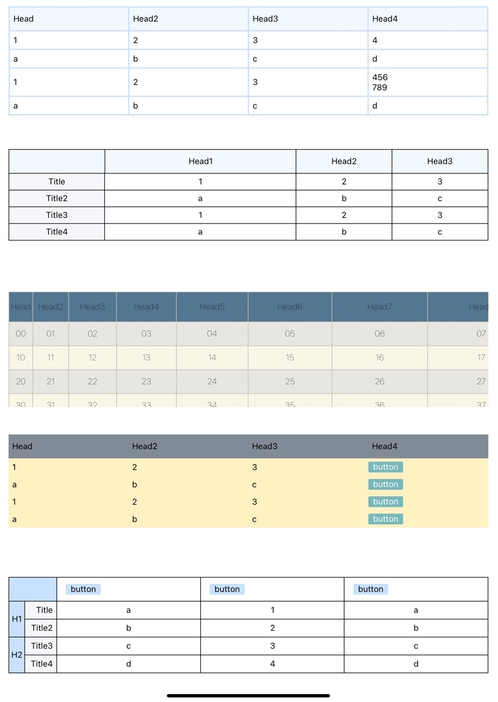

# Practicing how to use Table

## 1) react-native-table-component

[Gil2015/react-native-table-component](https://github.com/Gil2015/react-native-table-component)

: table component 사용 방법 공부

: class component를 funtion component로 바꾸면서 공부

## 2) 파일 설명

- Table1 : 기본적인 table-component 사용법
- Table2 : 칸 너비 임의 조정(비율)
    - <Row>태그의 flexArr 속성 이용

- Table3 : 칸 너비 임의 조정(크기) & 행마다 색깔 다르게 하기 & 스크롤 허용
    - <Row> 태그의 widthArr 속성 이용
    - style 속성 이용 ex) style={[styles.row, index%2 && {backgroundColor: '#F7F6E7'}]}
    - <ScrollView>태그 사용
- Table4 : 셀의 데이터 조건에 맞게 표시하는 법
- Table5 : 셀 병합
    - <Col> 태그의 heightArr 속성 이용

## 3) 실행 모습

</img>
